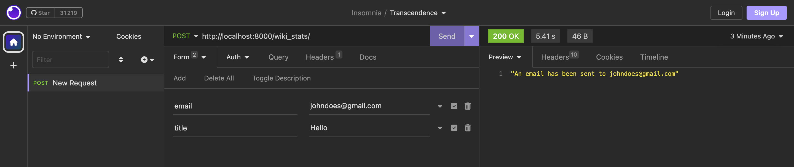
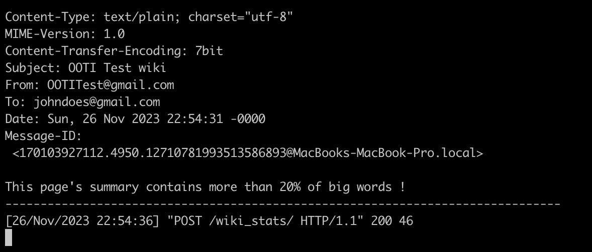

Hi and welcome to the OOTI wiki test.

To launch this test, make sure you have everything in the requirements.txt installed on your computer.
If so, just do `python3 manage.py runserver` in your terminal and press <kbd>Enter</kbd>.

First of, let's test it on an API Client, on this screenshot, a POST request has been sent to the server, and you can see the server response on the right :

Then, an "email" has been sent to the user :

Now that you have a normal test case, feel free to clone the repo and test more !

Thanks
